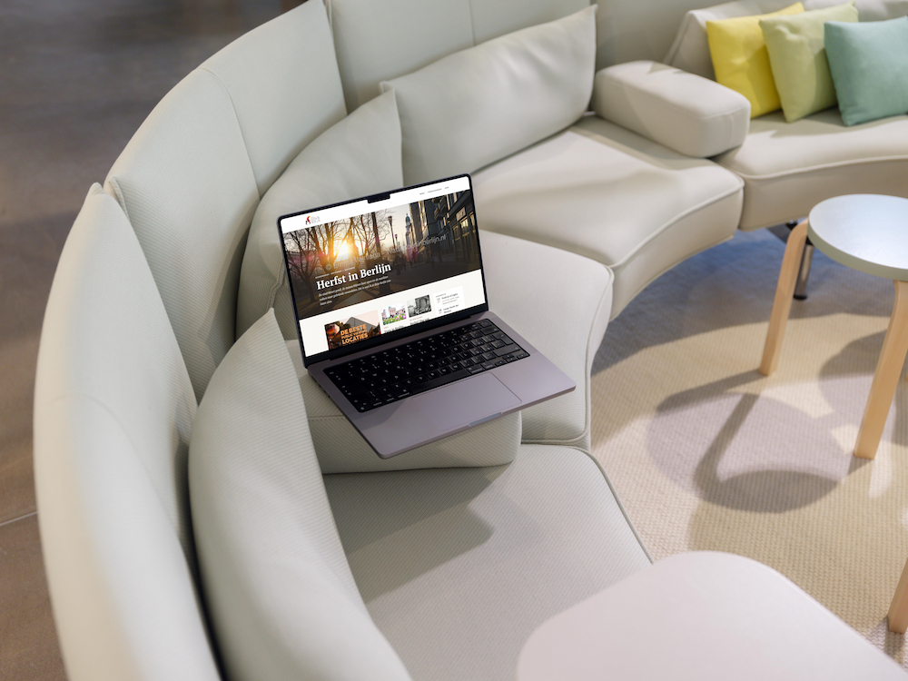

# mcp-mockuuups

MCP server for [Mockuuups Studio](https://mockuuups.studio/) — search ~5,300 device
and print mockups, then render a screenshot or your own image into them.

One design — the [WTDIB](https://wtdib.cdit-works.de/) Berlin city guide —
rendered into four mockups from a single photoshoot, so the room stays put while
the device changes. Two tool calls, no image hosting anywhere.

| | |
|---|---|
|  |  |
| `ipad-air` | `macbook-pro-14` |
|  |  |
| `iphone-15-pro` | `television` |

## Why this exists

Mockuuups ship [their own hosted MCP server](https://github.com/Mockuuups/mockuuups-mcp)
at `https://mcp.mockuuups.studio/mcp`. It exposes a single `generate_mockup` tool
that needs a mockup id you already know and an image you have already hosted
somewhere public.

This server wraps the underlying REST API instead, and closes the two gaps that
made the hosted one awkward in practice:

- **You can search.** The upstream catalog endpoint accepts no search parameters
  at all — `q`, `type`, `family` and `tag` are silently ignored and every request
  returns the same unfiltered page. The whole catalog is fetched once and searched
  locally, so "a tablet on a desk" or "poster" actually finds something.
- **You can upload.** Mockuuups renders from a URL only. Hand this server raw
  image bytes and it stages them under a short-lived unguessable link for the
  renderer to fetch, so a local design needs no bucket, no CDN and no hosting.

### Rendering an image you hold locally

Mockuuups renders from a URL only. Pass `image_base64` and this server stages the
bytes under a short-lived unguessable link, lets the renderer fetch it, and lets
it expire — no bucket, no CDN, no hosting account.


*The iPad render above, uploaded from disk and rendered into a framed A3 poster.*

## Tools

| Tool | What it answers |
|------|-----------------|
| `search_mockups` | Which mockup should I use? Free-text search over the whole catalog, with device-word aliases ("tablet", "poster", "laptop") and family/type/tag filters. |
| `create_mockups` | Put this design into these mockups. Takes a `screenshot_url`, `image_url` or `image_base64`, renders across several mockups concurrently. |
| `get_renders` | Did those renders finish? Polls anything that outran the inline wait budget. |
| `account_status` | How many credits are left, and what can this plan actually do? |

### Rendering one design across devices

Scenes shot together share a tag, so the way to get a consistent look across
devices is to search one, then filter by its tag:

```
search_mockups(query="ipad", tag="update-august-2024-meeting-room")
create_mockups(
    mockup_ids=["Zkn1GMTfiAFX5ZOn", "Zkn2DsTfiAFX5ZPD", "Zkn15MTfiAFX5ZO_"],
    screenshot_url="https://wtdib.cdit-works.de/",
)
```

## Requirements

- Python 3.12 or newer
- FastMCP 4 (`fastmcp>=4.0.10,<5.0.0`, installed as a dependency)
- A Mockuuups Studio account with a developer API key from
  [mockuuups.studio/developers](https://mockuuups.studio/developers/)

## Install and run

The package is not on PyPI; run it from a checkout.

```bash
git clone https://github.com/CaseyRo/mcp-mockuuups && cd mcp-mockuuups
uv sync
MOCKUUUPS_API_KEY=... uv run mcp-mockuuups                               # stdio
TRANSPORT=http MCP_API_KEY=change-me MOCKUUUPS_API_KEY=... uv run mcp-mockuuups   # streamable HTTP on /mcp
```

With Docker, the image builds from source:

```bash
cp .env.example .env   # fill in the keys
docker compose --env-file .env up -d --build
```

`compose.yaml` publishes the server on host port `8013` and has no volumes on purpose: staged uploads live in memory. The container exposes `/health`.

## Configuration

Every setting is an environment variable; [.env.example](.env.example) lists the common ones.

| Variable | Default | Purpose |
| --- | --- | --- |
| `MOCKUUUPS_API_KEY` | none | Mockuuups Studio developer key |
| `PUBLIC_BASE_URL` | empty | This server's public origin. Needed only for `image_base64` uploads, because the Mockuuups renderer fetches the staged image back over the public internet. A private network address stages fine and then fails at render time. |
| `MOCKUUUPS_MAX_SIZE` | `1000` | Largest render size sent upstream. Raise it when the plan has the `hires` feature. |
| `UPLOAD_TTL_SECONDS` | `900` | How long a staged upload stays fetchable |
| `UPLOAD_MAX_BYTES` | `12582912` | Size cap for one uploaded image (12 MiB) |
| `CATALOG_TTL_SECONDS` | `86400` | How long the fetched catalog is cached |
| `RENDER_WAIT_SECONDS` | `25` | Inline wait for renders before handing back `render_id`s |
| `TRANSPORT` | `stdio` | `stdio` or `http` (the Docker image sets `http`) |
| `HOST` | `127.0.0.1` | Bind address |
| `PORT` | `8000` | Bind port |
| `MCP_API_KEY` | none | Bearer token for the MCP endpoint. Required when `TRANSPORT=http`; the server refuses to start without it. |

## Authentication

Over HTTP, MCP requests must carry `Authorization: Bearer <MCP_API_KEY>`. The only unauthenticated routes are `/health`, `/healthz` and the staged-upload route `GET /i/{token}.{ext}`, which the Mockuuups renderer has to reach. That route is protected by a 256-bit random token, a short TTL, a size cap, and a check that only real image bytes are served.

## Slow renders

`create_mockups` dispatches every render concurrently and waits up to `RENDER_WAIT_SECONDS`. Anything still running comes back as `pending` with a `render_id`; the CDN links are already allocated. Pass those ids to `get_renders` (optionally with `wait_seconds` to long-poll) until they settle. Failures raise a tool error.

## Plan limits worth knowing

The API bills in credits: **one render = 1 credit, +1 for a website screenshot,
+1 for hi-res**. Only successful renders are charged.

Two behaviours will bite you if you don't know them:

- **Omitting `size` means hi-res**, which hard-fails with `feature-not-available`
  on any plan without it. This server always sends `size` explicitly, capped by
  `MOCKUUUPS_MAX_SIZE` (default 1000, the Trial ceiling). Raise it when the
  account has the `hires` feature.
- **On plans with `cdn-temporary`, delivery links expire after ~24 hours.**
  Download anything worth keeping. `account_status` reports this.

## Usage telemetry

A small middleware (`usage.py`) writes one JSON line per tool call to stderr with the server name, tool name, duration, outcome and protocol version. It never logs arguments or results.

## Development

```bash
uv sync
uv run pytest
```

Tests need no network: the catalog, upload store and every tool are covered with fakes. CI (`.github/workflows/ci.yml`) runs them as the `test` check on every pull request. `main` is protected and changes land through pull requests.

## Releases

Releases are tag-only. After a merge to `main`, the release workflow tests the code and pushes the next `v*` patch tag; nothing is committed back to `main`. Do not bump `version` in `pyproject.toml` by hand. Deployments build the Docker image from source.

## Support

If this server saves you time, you can [buy me a coffee](https://buymeacoffee.com/caseyberlin).

## License

Released under the [MIT License](LICENSE).
